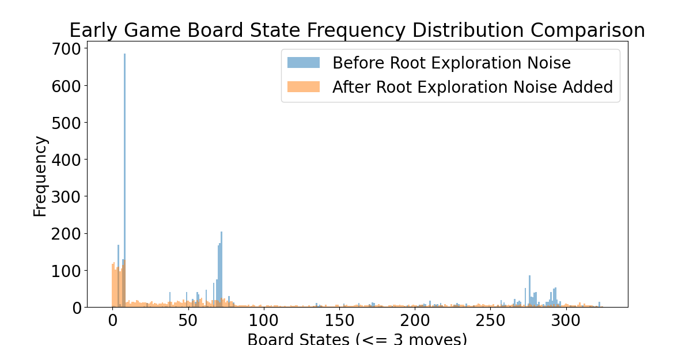
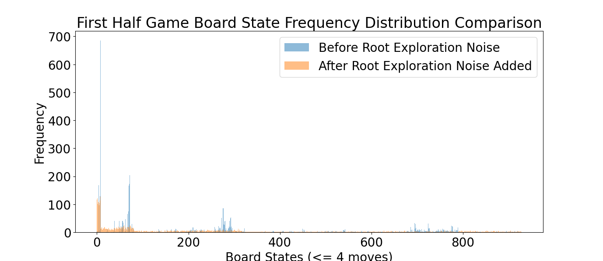
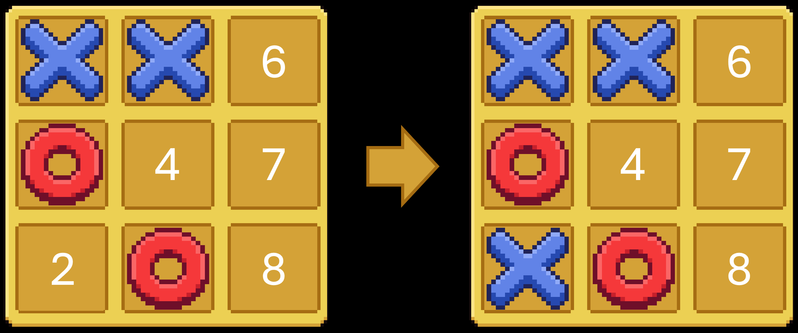
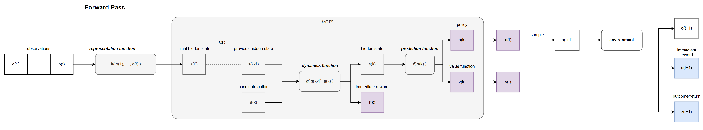

# DEV LOG

## 2025-12-26

Up until now I refused to add the Dirichlet exploration noise to the root node. I thought this seemed very unnecessary since tic-tac-toe is game with such limited action space that surely MuZero would naturally explore all the game spaces anyway...

But to be sure, I tracked the number of unique board states reached in 1000 games of MuZero self-play, before I introduced root exploration noise and after. Looking at the board states in the first 3 moves of the game, impact of exploration noise is apparent:



Similar effects can be see if you "zoom out" and look at the first 4 moves of the game:



More importantly, I realized that I am processing each sample within a batch in series and should instead send the entire batch to the neural nets to process in parallel. This speeds up training times significantly.

After a bit more debugging w.r.t. the rewards*, I'm now confident the code is basically correct so it's time to do some hyperparameter tuning in consultation with Gemini Code Assist. 


*(Gemini said there needed to be a way to communicate a -1 loss to the opponent player, which I don't think I need to do since there's Negamax, but did it anyways to be on the safe side).


### Prompt to Gemini Code Assist

What:
I am currently training a MuZero agent from scratch to play tic tac toe and so far see very bad performance of the MuZero agent against a random agent

```
MuZero Agent Performance, as P1: 69.00% win-rate, W-L-D=[69, 23, 8], as P2: 25.00% win-rate, W-L-D=[25, 65, 10]
```

I am using the following configs:

```python
config = {
    'batch_size': 128, # batch size for MuZero neural net training
    'buffer_size': 100, # number of game episodes in the ReplayBuffer
    'state_size': 16, # MuZero representation function outputs a 16x1 hidden state representation for the initial 9x1 representation of the tic-tac-toe board
    'hidden_size': 64, # MLP hidden size
    'lr': 3e-4, # AdamW optimizer learning rate
    'weight_decay': 1e-4, # AdamW optimizer weight decay parameter
    'max_iters': 80, # number of MCTS simulations for each agent step/action
    'train_iters': 10, # number of training batches per neural net weight updates
    'gamma': 1.0, # discount factor for reward/returns
    'k_unroll_steps': 5, # K steps into the future for unrolling game trajectory during batch sample
    'temperature': 1.0, # softmax temperature for action selection
    'dirichlet_alpha': 0.3 # exploration noise added to root node's child nodes' priors.
}
```
Please do the following:
- Look up the MuZero algorithm proposed by DeepMind in their paper and pseudocode, especially in terms of hyperparameters.
- Suggest changes to the above config for playing a much simpler board game of tic-tac-toe.
- Consider the smaller scale of tic-tac-toe compared to other board games (max 9 time step per trajectory, a small action space per agent per turn, etc.)


Boundaries:
- DO NOT suggest changes that alter the neural networks proposed in `muzero.py`.
- Focus on getting MuZero implementation to work for tic-tac-toe. I am not concerned about generalizing this agent to other games.
- I intend to implement this on a single CUDA-enabled GPU. Do not assume I have vast computing resources of Google/DeepMind.
- Stick to using PyTorch as the ML library/framework.
- I expect to train the MuZero agent over 500 games of tic-tac-toe max. Note this is not the same as `train_iters` in the above config.
- Therefore, you must suggest a `buffer_size` less than 500.
- DO NOT MODIFY ANY CODE FILES. Only make verbal suggestions.

Success:
- Achieve 100% win rate against random agent when MuZero agent is player 1 in tic-tac-toe.
- Achieve 0% lose rate against random agent when MuZero agent is player 2 in tic-tac-toe.

### Gemini Response

buffer_size: 100 -> 400

Reasoning: The original MuZero paper used a replay buffer of 1,000,000 games. While that's for complex games and with vast resources, the principle is to maintain a large and diverse set of past experiences to train on. Increasing the buffer to hold data from 400 games (out of your 500-game training run) will provide more stable and diverse batches for the network, leading to better convergence and preventing the agent from forgetting what it has learned.

train_iters: 10 -> 100

Reasoning: This is the most critical change. The agent needs to learn more from the games it plays. The original algorithm performs one training step for every N simulation steps. By increasing train_iters, you are allowing the network to train more extensively on the data in the replay buffer after each game. This will significantly speed up learning and help the agent's policy and value predictions converge faster.

max_iters: 80 -> 50

Reasoning: Tic-Tac-Toe has a very small search space. 80 MCTS simulations per move is more than enough. Reducing this to 50 will speed up the data generation (self-play) phase without a significant drop in playing quality, allowing the agent to complete more games and training cycles in the same amount of time.
temperature: 1.0 -> 0.5

Reasoning: A lower temperature makes the agent's action selection more greedy, meaning it's more likely to pick the move that the MCTS search identifies as the best. While a temperature of 1.0 encourages exploration, it can lead to too many random moves in a simple game. A value of 0.5 strikes a better balance. Ideally, you would anneal the temperature (start high and lower it over time or after a few moves), but a single lower value is a good first step.
dirichlet_alpha: 0.3 -> 0.05

Reasoning: The Dirichlet noise is added to the root node during MCTS to encourage exploration of different moves. The original value of 0.3 was used for Go (branching factor >200). For Tic-Tac-Toe (branching factor <=9), this much noise is excessive. Reducing it to a smaller value like 0.05 will ensure the MCTS can focus its search on more promising moves, which is more appropriate for a game with a small action space.

## 2025-12-25

- [x] Add a log for tracking the unique board states visited every 10 episodes. Are they always the same games?
- [x] Then add Dirchlet noise to encourage explanation
   - [x] See the performance. See the state exploration
- [x] Then add temperature annealing

- [ ] ~~Increase training epochs to 100 per update~~ This can take a while per update depending on the batch size and can lead to overfitting (Note that this is also because the batches are processed in series not in parallel.)
- [x] Increase learning rate to `1e-3`
- [ ] Add more layers to the MLPs


### My Prompt

I am currently training a MuZero agent from scratch with the following configs:

```python
config = {
    'batch_size': 16, # batch size for MuZero neural net training
    'buffer_size': 10, # number of game episodes in the ReplayBuffer
    'state_size': 16, # MuZero representation function outputs a 16x1 hidden state representation for the initial 9x1 representation of the tic-tac-toe board
    'hidden_size': 64, # MLP hidden size
    'lr': 3e-4, # AdamW optimizer learning rate
    'weight_decay': 1e-4, # AdamW optimizer weight decay parameters
    'max_iters': 80, # number of MCTS simulations for each agent step/action
    'train_iters': 100, # number of training batches per neural net weight updates
    'gamma': 1.0, # discount factor for reward/returns
    'k_unroll_steps': 5, # K steps into the future for unrolling game trajectory during batch sample
    'temperature': 1.0, # softmax temperature for action selection
}
```

I have trained the agent for 100 game episodes of self-play. Every 10 episodes, I evaluate the agent's performance by pitting it against a random agent for 100 games where agent is player 1 and 100 games where agent is player 2. The performance at the end of training is bad. Agent Performance, as P1: 44.00% win-rate, W-L-D=[44, 32, 24], as P2: 14.00% win-rate, W-L-D=[14, 59, 27]

Please do the following:
- Review and survey the most recent research and discussion around MuZero's algorithm.
- based on that survey, suggest hyperparameter configs that should work better for achieving the best performance results in tic-tac-toe.

Boundaries:
- For now I still wish to keep using MLP neural nets, since I suspect that for a game like tic-tac-toe, sophisticated ResNets/CNNs and the like are not necessary here.
- Do NOT modify the code but feel free to give suggestions on where errors in implementation may be.
- For now, ONLY suggest changes to the above config based on what ML researchers/engineers have observed in terms of MuZero playing board games.
- Keep in mind that the game is tic-tac-toe. I am not interested in more complicated games. But I do want to ensure optimal performance for this specific game.

Success:
- Achieve 100% win rates against random agent when MuZero agent is either player 1 or player 2 in tic-tac-toe.

### Gemini Response

#### Analysis of Current Hyperparameters

The most significant issue with your current configuration is likely the extremely small replay buffer.

**buffer_size=10**: A replay buffer of only 10 game episodes is insufficient. The agent is likely overfitting to the most recent, potentially low-quality games it has played. For an agent to learn robust strategies, it needs to sample from a large and diverse set of past experiences.

**train_iters=100**: Training for 100 batches on data from a tiny 10-game buffer will almost certainly lead to catastrophic forgetting and overfitting. The agent is essentially memorizing a very small slice of its own recent, poor-quality play.

**max_iters=80**: 80 MCTS simulations is a reasonable number for Tic-Tac-Toe, perhaps even on the higher side. It should be sufficient for a strong search.

The other parameters are reasonable starting points, but the buffer size and its interaction with training iterations are the most critical problems.

#### Suggested Hyperparameter Changes
Here is a revised configuration designed to promote stable learning and achieve high performance in Tic-Tac-Toe. The main goal is to significantly increase the experience diversity for the agent.

```python
config = {
    # Training
    'lr': 1e-3,             # Increased learning rate, common for smaller/simpler models.
    'weight_decay': 1e-4,     # Kept the same, standard value.
    'batch_size': 128,          # Larger batch size for more stable gradients.
    'train_iters': 10,          # Fewer training steps per update cycle to prevent overfitting to the current buffer state.
    
    # Replay Buffer
    'buffer_size': 2000,        # A much larger buffer to store a diverse set of games.
    
    # MCTS / Action Selection
    'max_iters': 50,          # Reduced simulations; 80 is likely overkill for Tic-Tac-Toe. 50 is plenty.
    'gamma': 1.0,             # Correct for deterministic, finite games.
    'k_unroll_steps': 5,        # 5 is a good number of steps to unroll for learning game dynamics.
    'temperature': 1.0,         # Keep temperature for exploration during self-play.
    
    # Model Architecture
    'state_size': 32,           # Slightly larger state size for more representational capacity.
    'hidden_size': 128,         # Larger MLP hidden size to match.
}
```

#### Justification for Changes:

Replay Buffer (buffer_size): I've increased this from 10 to 2000. This is the most critical change. A large buffer ensures the agent learns from a wide variety of game trajectories, preventing it from overfitting to its most recent games.

- **Training (lr, batch_size, train_iters):**
  - I've increased the batch_size to 128 to provide more stable gradient updates.
  - Consequently, I've reduced train_iters to 10. You want to perform fewer, more stable updates per cycle to avoid overfitting on the samples currently in the buffer. The learning process should be a slow, steady distillation of experience from the large buffer, not a rapid memorization of new games.
  - I've slightly increased the lr to 1e-3, which can speed up learning for smaller-scale problems like this one, especially when paired with a larger batch size.

- **Model Size (state_size, hidden_size):** I've slightly increased the sizes of the representation and hidden states. While Tic-Tac-Toe is simple, giving the network a bit more capacity (state_size: 32, hidden_size: 128) can help it learn the nuances of the game dynamics, value, and policy more effectively without being excessive.
- **MCTS (max_iters):** I've reduced the MCTS simulations to 50. For Tic-Tac-Toe, 80 simulations per move is likely more than needed. A value between 30-50 should be sufficient to find the optimal move, and reducing it will speed up self-play, allowing the agent to gather more experience faster.

#### Potential Implementation Notes to Check:

While you asked me not to modify the code,I highly recommend ensuring these two concepts from the AlphaZero/MuZero papers are correctly implemented, as they are crucial for performance:

**Dirichlet Noise:** For effective exploration during self-play, the original papers add Dirichlet noise to the root node's policy distribution during the MCTS search. This forces the agent to explore moves it might otherwise ignore, which is essential for finding new, better strategies. A common value for the alpha parameter is 0.3.

**Temperature Annealing:** While a temperature of 1.0 is good for exploration in the opening moves of a game, it's common practice to anneal (lower) the temperature to near-zero after a certain number of moves (e.g., after 4 moves in Tic-Tac-Toe). This makes the agent pick the best-found move (exploit) for the rest of the game, leading to higher-quality game data being stored in the replay buffer.

With the proposed configuration and a correct implementation, the agent should be able to achieve a dominant win rate against a random opponent.

## 2025-12-24

Calling it a night now that I'm confident the code is right and I can leave it to train over night.

Some notes on interesting things that came up as I reviewed and revised the code (a lot):

Ah now I understand `td_steps` being set to `max_moves` for a board game!

In the pseudocode's `make_target()` function:

```python
      bootstrap_index = current_index + td_steps
      ...
      if bootstrap_index < len(self.root_values):
        value = self.root_values[bootstrap_index] * self.discount**td_steps
      else:
        value = 0
```

Since `td_steps` is set to `9` for tic-tac-toe, `bootstrap_index` is guaranteed to go beyond the end of the game, and value is intialized to 0. THEN the final reward is accounted for at the end of the game:

```python
      for i, reward in enumerate(self.rewards[current_index:bootstrap_index]):
        if self.player_history[current_index + i] == current_player:
          value += reward * self.discount**i  # pytype: disable=unsupported-operands
        else:
          value -= reward * self.discount**i
```

And the signs are flipped appropriately so a player 1 win of +1 gets interpreted as a player 2 loss automatically. This means that the final outcome of the game is effectively accounted for regardless of where the sample trajectory starts (i.e., regardless of the random value of `current_index`)

(DeepMind did not provide this exact code accounting for whether the player's turn at index `i` is the same as `current_player` at `current_index`, I had Gemini look into this and add more if statements and player history tracking.)

Also absorbing states past the end of the game means a uniform policy is added as a target because it doesn't matter (may want to revisit this further but makes sense). DeepMind did it this way:

```python
# States past the end of games are treated as absorbing states.
targets.append((0, last_reward, []))
```

I ended up doing it this way:

```python
uniform_policy = torch.ones_like(target_policies[0]) / target_policies[0].numel()
targets.append((uniform_policy, last_reward, 0))
```

One of my earlier versions of `sample_batch()` makes targets for the neural nets predicting value and reward assuming the "current player" is always the player whose turn it is at the beginning of the trajectory slice (player turn at `sample_trajectory[0]`). Subsequent determinations of the sign of the value/reward (+1/-1) would compare whose turn it is in a future step relative to that "current player." So I set `current_player` outside of the `for i in range(ix, ix+k_unroll_steps+1):` loop

But reviewing this with Gemini, the correct thing is to set "current player" to whose turn it in each future unroll step, inside the `for i in range(ix, ix+k_unroll_steps+1):` loop. Because you actually need to compare the player's turn at future bootstrap index and at timesteps previous to the bootstrap to determine the correct sign.

Gemini explains:

The reason the perspective is based on current_index (the specific step in the unrolled future) rather than state_index (the root of the search) comes down to what the neural network is being trained to predict at each specific step.

Here is the reasoning in terms of the Network and MCTS:

1. The Network's Job is Local to the State
In MuZero, the training process "unrolls" the network forward in time.

At state_index (step 0), the network sees the root state $S_0$ and predicts Value $V(S_0)$.
At current_index (step $k$), the network sees a hidden state representing $S_k$ and predicts Value $V(S_k)$.
In a zero-sum game (like Chess or Go), the standard definition of a state's "Value" is relative to the player whose turn it is in that state.

If it is Player A's turn at $S_k$, a Value of $+1$ means Player A is winning.
If it is Player B's turn at $S_k$, a Value of $+1$ means Player B is winning (which implies Player A is losing).
The neural network is designed to be a function $f(s) \rightarrow v$. It doesn't know about the history of who started the search $k$ steps ago; it only knows "I am in this state, it is my turn, how good is this position for me?"

2. Consistency with MCTS (Negamax)
The MCTS algorithm typically uses a "Negamax" backup strategy for zero-sum games.

When the search tree reaches a leaf node (corresponding to current_index), the network returns a value $v$.
The MCTS algorithm assumes this $v$ is good for the player at that leaf node.
When backing up to the parent node (where it was the opponent's turn), MCTS flips the sign ($-v$).
If you trained the network using the perspective of state_index (the root player), then when the unroll reaches a state where it is the opponent's turn, the network would be trained to predict the root player's value (e.g., "I am Player B, but the value is -1 because Player A is winning"). This would break the Negamax assumption in MCTS, which expects the value to be positive if the current player (Player B) is winning.


## 2025-12-23

Slowly making my way through the TODOs I wrote yesterday. Going to call it a night but one other major thought bubble is I will probably resort to some vibe-coding JUST to help debug:

- Show in terminal output what the replay buffer looks like after a game is complete, just to double check the values
- Show what a single simulation tree looks like to make sure the values are the right sign.

I'll add more terminal output debugging ideas later but that's it for now...

## 2025-12-22

OK now going to just fully read the DeepMind's pseudo-code and take a look at each part side-by-side:

- DM's `Game` class tracks `child_visits` and `root_values`, which are:
  - `child_visits` the *normalized* child visits serving as target policy during training
  - `root_values` which are then used to derive a target value from discounted rewards/values
  - A `td_steps` parameter is used to look ahead a limited number of steps when computing the discounted value, necessary for very long games.
  - Another small-but-big detail is that `Game.make_target()` makes sure to include tuple for the targets for the `Network.initial_inference()`, which doesn't predict a reward value, but the target reward is provided as `last_reward = 0`.
- DM's `ReplayBuffer.window_size` specifies the number of game trajectories in the buffer.
  - Whem a game trajectory is stored with `ReplayBuffer.save_game()` the older games are popped off once the length of the buffer exceeds `window_size`.
  - `window_size` doesn't specify the number of total steps (state action transitions) an agent has made/experienced. It specifies the total number of game episodes/entire trajectories the agent has experienced.
- DM uses a `Network` class to do both `initial_inference()` and `recurrent_inference` to elegantly combine the outputs of the three neural nets, etc.
  - Then `SharedStorage` keeps track of the latest training network weights for running parallel self-play jobs
- `select_action()` makes use of softmax temperature when sampling the next action to play in a game.
  - similarly `add_exploration_noise` "adds dirichlet noise to the prior of the root to encourage the search to explore new actions."
- In `ucb_score()`:
  - This line looks different from what I did: `value_score = child.reward + config.discount * min_max_stats.normalize(child.value())`
  - In equivalent variable names, my `value_score = min_max_stats.normalize(child.value())`...
  - the `value_score = 0` if the child node in question doesn't have any visit counts. I've done the same thing basically by reporting a node's `mean_value` is 0 if it has `N=0` visit counts.
- `backpropagate()` looks way nicer than my `backup()` function, especially with fewer if statements.
  - it seems like the backpropagate starts with the leaf node.
- my `search()` function has to be compared to DM's `play_game()` and `run_mcts()` functions:
  - `play_game()` creates the root node and sets its state with the `intial_inference()` using representation and dynamics function
  - `run_mcts()` runs the tree search simulations
- `train_network()` initializes the networks and Momentum optimizer and includes calls to function that save the network weights over multiple training steps.

Things I want to review and revise carefully:
- [x] My `ReplayBuffer` stores the `final_outcome` and `reward` two separate lists.
  - [x] For a board game a single list is all you need and should look something like `[0, 0, 0,...,0,+1,-1]`
  - ~~This does leave me feeling a little confused about how self-play happens - how do you record the player_2's loss after the player_1 wins?~~ I'm guessing that so long as I track which player won and then alternate the reward/value signs via NegaMax when sampling targets and tree search backups, this should be OK.
  - [x] Looks like DM's pseudocode doesn't show how the target value needs to flip in sign for the opposing player (i.e., `Game.make_target()` is a little incomplete, it does have `to_play` as an input parameter, but doesn't make use of it. this function should check if the player at `state_index` is different from the player at `bootstrap_index` and flip the sign).
- [x] My current code doesn't yet discount the rewards and values when computing target values. Even though I am only interested in getting things working for tic-tac-toe with a max of 9 steps per game, this seems like a useful thing to compute should I ever extend this to other games.
  - [x]Also look into the value of `td_steps` for board games being set to `max_moves`...So for tic-tac-toe this value is 9...and that means the agent also looks 9 steps ahead, regardless of the state of the board?
- ~~I *think* that the reason my current `predictions` and `targets` lists are different lengths is because I do NOT include the target for the initial inference...~~ after revising `sample_batch()` the predictions and targets are the same length
- [x] Ensure the buffer length remains under a specified `buffer_size`
- Softmax temperature sampling and Dirichlet noise seem like overkill when I just want to get MuZero to play tic-tac-toe BUT could still be necessary ways to encourage exploration during training, generating more diverse data that we now really need since we are using three friggin' neural nets...
- [x] Double check my `pUCT()` function and see how to implement `value_score = child.reward + config.discount * min_max_stats.normalize(child.value())` using my own class definitions. 
- [x] More importantly ask why this is done, since it doesn't appear to match the Equation 2...
  - Welp, looks like I forgot the basics of the Bellman Equation and only used the value of the child as the "Q-value." I should remember that a Q-value is almost always an immediate reward and discounted value sum ($Q = R + \gamma V$)
- [x] I'll re-write my `backup()` using `reversed(search_path)` and see if it makes sense to not care if the current node is a leaf node or not.
- [x] In conjunction with the above, the `search()` function may need to be revised in a couple ways:
  - [x] After the root node is created with a hidden state, there shouldn't be a `backup()`...
  - [x] the `backup()` should account for the latest leaf node's `current_player` (found via the `whose_turn(action_history)`) and flip the signs of the value accordingly
- [x] add training loop to `update()` function so that the networks train over multiple epochs / multiple batches.
- consider switching to the MomentumOptimizer...
- [x] I sorta think I have to now set up a self-play muzero training loop, and write a separate evaluation function that pits MuZeroAgent against random agent as player 1 or player 2 and see the win-loss-draw proportions.


## 2025-12-21

Tried to make a push to finish this thing and...
- well it can run through games and update weights after computing a loss function but...
- I think there's an issue with the way I'm computing target value (without a discount factor)
- There may be some other issues with how I'm pairing the targets with the neural network predictions...
- And I still haven't gotten around to the issue of self play
- and storing neural net weights...
- and separate training and test loops...

So all in all, I still have a ways to go before I can start properly tuning the various hyperparameters.

Small update: twiddled a bit with hyperparameters (`max_iters`) and saw some encouraging training results at the end of 100 episodes:

```
0:07:51.005167 EP=99, [64, 29, 7] # W-L-D record as player 1 against random agent
```

Of course, I also continued running the trained model in a visible game:



The agent is Player 1 placing the X pieces. After Player O's random move in board location index=5, the agent predicted the following action probabilities:

```
Action Probability 0 = 0.00%
Action Probability 1 = 0.00%
Action Probability 2 = 31.83%
Action Probability 3 = 0.00%
Action Probability 4 = 23.64%
Action Probability 5 = 0.00%
Action Probability 6 = 15.59%
Action Probability 7 = 15.24%
Action Probability 8 = 13.64%
```

...and went to board index=2! Why isn't the probability for board location 6 wayyy higher?!?!?

Lots more debugging ahead.

#@ 2025-12-20

OK, time to make this more real with an actual `MuZeroAgent` class. I've been shying away from doing this until now because I really wanted to focus on the individual functions rather than worry about which variables have to be attributes of which class. But now I do want to start thinking about this more.

I'm still working out how the training / weight updates actually happen since I've come to realize I have not really don't three neural networks being trained as a single "model" with weight updates coming from multiple loss functionals summed into one. Will clarify this tomorrow and hopefull get something finally running!

## 2025-12-19

I did a quick draft of commented pseudo-code describing the ReplayBuffer and training/update neural net weights

The main thing that took me a while to understand is the `target_policy` (i.e., number of action node visits during MCTS simulation, normalized so it's like action probabilities), which is compared with the prediction function's `policy` output (i.e., logit scores for each action, ~~which can be converted into probabilities~~), via cross entropy loss.

Now I'll try to turn pseudo-code into some actual code.

## 2025-12-18

Going to review the code written so far with Gemini. My prompt template is something like this:

```
{
  What:
    - "I am writing my own implementation of MuZero from scratch."
    - "The implementation is NOT complete. I've done a basic draft of the MuZero Search algorithm"
    - "Please review the specific function I have highlighted and check for any major inconsistencies with how MuZero works for that specific function"
    - "Suggest any code changes I should make for the function and explain."
    
  Boundaries:
    - "Only consider the function that I have highlighted and point to."
    - "Only modify the lines within the function. DO NOT modify lines outside function"
    - "You may explain verbally (NOT CODE) how a modification within the function relates to other functions outside the highlighted scope."
    - "Your response should focus on one specific part/phase of MuZero search without explaining the rest of the algorithm in great detail."
    - "Do not add ReplayBuffer or other data structures that are required for loss function computation and neural network training."
    - "Only focus on the 'forward pass' or MuZero MCTS for deciding the next move given the latest/current game state."
    - "Do not modify the PyTorch neural network Functions defined above. I do not care about improving the neural nets."
    - "Do not worry about references to the environment `env`. I will take care of how the environment performs specific functions in a different class definition."
    
  Success:
    - "I am less interested in implementing a full MuZero algorithm for complicated games, and more interested in learning how to write a very basic form of MuZero for a simple game like tic-tac-toe."
    - "I am learning how to implement MuZero, so I want a detailed understanding at a function/specific phase level of how the algorithm works and how the code should reflect that."
}
```

Use the above prompt for reviewing my `expansion()` function I'm already learning that the expansion should only expand the legal moves.
- Initially I thought it's not possible to identify legal moves during MuZero search because it's using a hidden state representation...
- But that alone doesn't prevent one from determining legal moves.
- At the very start of MCTS we are given the explicit game board and the game tells us the legal moves (`gymnasium` does so with `observation[action_mask]`)
- But that's not all! MuZero search **still** predicts "explicit" actions to take at each node of the tree.
- So during simulation / `selection()` we track these action in `ACTION_HISTORY`
- Using both `ACTION_HISTORY` and combined with the original game board, we can also infer subsequent legal moves.
- To be clear, this does mean we do still track explicit representations of the future board states BUT those explicit representations are never given to the model.


Also, it appears I mis-read Equation 3 in Appendix B describing the bootstrap backup update of node values:

As written in the paper:

$$
G^k = \sum_{\tau=0}^{l-1-k}{\gamma^\tau r_{k+1+\tau}} + \gamma^{l-k}{v^l}
$$

A less confusing way of writing it:

$$
G^k = \gamma^{l-k}{v^l} + \sum_{\tau=0}^{l-1-k}{\gamma r_{k+1+\tau}}  
$$

To the RL PhDs, this is trivial because they probably know the discounted reward formulas from Sutton and Barto off the top of their heads, but for a dumb person like me, I thought $\gamma^{l-k}{v^l}$ was *inside* the summation term...as a constant...accruing over and over each node...

Yes, in hindsight this is really dumb, but hey lesson learned! My nicer equation version clearly shows that you start by initializing $G$ with the value $v$ computed by the prediction function $f_\theta$ before going into the backup for-loop.

More importantly, I wrote an inner for loop to represent this summation performed at node $k$ but actually, there's no need for an inner for loop. As you traverse the nodes in reverse order, you can use the previously computed discounted reward $G^{k+1}$ in your current computation of $G^{k}$. i.e.:

```
G = reward + GAMMA * G
```

In the `search()` I made a major mistake in passing the wrong state to the dynamics function:

```
last_node, search_path, action_history = selection(root_node)
state, reward = DynamicsFunction(last_node.state, action_history[-1])
```

The end of the search returns `last_node` or the leaf node, which is unexpanded and does not have a hidden state defined yet! So `last_node.state` is `None`. From an RL-intuition about MuZero, it also doesn't make sense because the whole point of having dynamics function IS to predict THIS leaf node's hidden state.

So the correct thing to do is to look up the parent node's state and give it to dynamics function. This is easy with the `search_path` list keeping track of that already. 

```
last_node, search_path, action_history = selection(root_node)
parent_node = search_path[-2]
state, reward = DynamicsFunction(parent_node.state, action_history[-1])
```

Finally, with the way I have things written, the first time I make the root node and expand also requires me to do a backup phase because
- prediction function has made a value estimate based on the initial state
- `expansion()` does not "initialize" the node's `value_sum` or visit counts `N`
- so a quick `backup()` is needed before the main for loop in `search()`

Moreover I forgot to alternate the sign of the discounted reward/value `G` based on whether the node corresponds to current player or not! (same issue with regular UCT)

Now I can move on to writing the training functions, `step()` and `update()`, `ReplayBuffer` class...

Still a ways to go!


## 2025-12-17

One of the struggles with implementing this based on the Appendix B text is that the writing does not describe auxiliary data structures that come in handy to help keep track of things during the tree search. A `TreeNode` and `TreeEdge` class storing states and other statistics alone isn't going to cut it.

A few data structures visible in the pseudocode:
- `search_path` a list that just tracks the nodes traversed during Simulation/Selection phase, which comes in handy during expansion phase
- `action_history` a list of actions explored during the Simulation/Selection phase, which comes in handy when determining whose turn it during the tree search and looking up the last action during the selection phase.
- Though Appendix B states that tree nodes store state and tree edges store statistics, a `Node` class is really all you need, provided that the `children` attribute is a dictionary with actions as keys and child `Nodes` as values.

In general, I'm referring to the pseudocode provided by the MuZero paper authors now and feel more confident in my latest draft of the "forward pass." I'm planning to review each function and see if anything needs corrections first before moving onto adding `ReplayBuffer` and figuring out how training/loss function/backprop actually works.

The somewhat unintuitive thing I got from the pseudocode is that `Nodes` are intiated only with a policy prior score at first and then later get hidden state and reward defined during expansion after representation/prediction/dynamics functions do their thing. I *guess* these things can happen in either order...I'll revisit this tomorrow during the review.

## 2025-12-10

Took a stab at programming the forward pass (i.e., the "planning" part A in Figure 1 of the MuZero paper)

Then I hit a wall in coding when I had to figure out how to actually select an action ("acting" part B in Figure 1). 

Couple points of confusion:
- Even during planning it was unclear where "candidate actions" come from. I reasonably assumed that they could at least be chosen based on "unexplored actions" for unexpanded tree nodes, but after a node has all possible actions explored, how are candidate actions selected?
- I thought the answer to my above question was to select children with the highest value estimated by the prediction function, but this turns out to be completely wrong.
- I got a sense that the above was wrong when I read Appendix B of the MuZero paper. Appendix B covers the actual Search algorithm of MuZero (*Note to self: Appendices of ML research papers contain at least 50% of their actual useful information*)
- Reading the above Appendix still seems daunting, but I'm seeing now-familiar terms like upper-confidence bound and backup from my MCTS reading.

Basically I'm starting to realize how my original diagram doesn't really capture the MCTS nature of the MuZero algorithm.
- During planning, MCTS follows Appendix B Search to select candidate actions and create a tree. Visit counts to each node/edge are stored, since this is the key part for...
- Acting, or more accurately, action sampling. A greedy method would just be to pick the node with the highest visit count, but there's a fancy formula involving temperature and probabilities based on the visit count to ensure some amount of exploration when the agent actually decides the next move.

I'm pushing the changes I have for now, but I think I need to re-visit the diagram I made and in particular see if I can somehow incorporate the Appendix B search steps/formulas. This should give me a better mental model before doing more coding. Appendix B also seems to have clearer language on the data structures and storing of the statistics to enable MCTS.

## 2025-12-08

This is the "official" hello world post for this project! I did start working this before today, but that was to familiarize myself first with Monte Carlo Tree Search (MCTS) and specifically Upper Confidence Tree (UCT) Search. After I read the MuZero paper, this seemed like a critical concept that I didn't know much about relative to other RL and deep RL concepts I have done in the past (Q-learning, DQN, PPO, MLP Actor-Critic). So last week I read about [MCTS](http://incompleteideas.net/609%20dropbox/other%20readings%20and%20resources/MCTS-survey.pdf) and then got [it to work](https://github.com/holistudio/DumbestMuZero/blob/main/src/agents/mcts/mcts.py) for the game of tic-tac-toe!

For implementing MuZero, I made the following diagram as I read the [MuZero paper](https://arxiv.org/abs/1911.08265):



The goal for now is to implement the above diagram, before I (inevitably) struggle and refer to the paper's Python pseudo-code `D:`

Here goes nothing!
